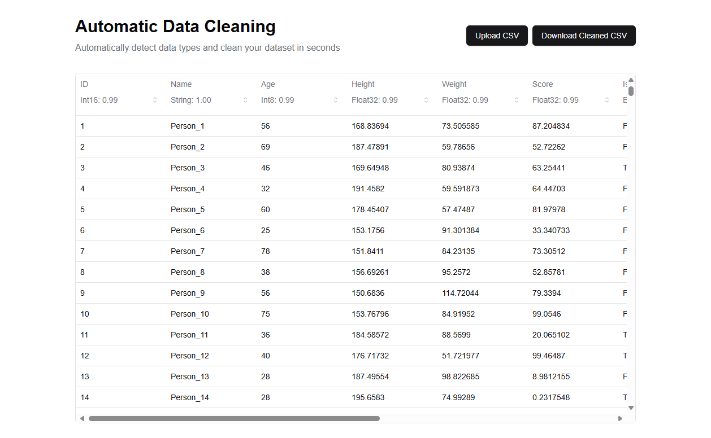

# Automatic Data Cleaning
This is a demo project for automatic data cleaning. Following are key features:
- Data type detection: automatically detect data type of each column, and provide statistics score
- Big data support: support processing 100,000+ rows data in a few seconds, and display 100,000+ rows in the UI with smooth scrolling
- Manual type adjustment: user can manually adjust data type of each column

## Online Demo
You can access the online demo at https://automatic-data-cleaning.vercel.app/

## Local Development
### Prerequisite
- Node.js == 20
- Python == 3.12
- pip
### Installation
```bash
pip install -r api/requirements.txt 
# install python dependencies
npm install
# install node dependencies
``` 
### Run Dev Server
The following command will start the development server for both frontend and backend:
```bash
npm run dev 
```
Now you can access the web app at http://localhost:3000

### Run Unit Test
The following command will run the unit test for backend, it will also generate example datasets under folder `api/test_data`:
```bash
npm run test
```

## Interface
User can upload a CSV/Excel file or try the example dataset.

User can manually adjust the data type of each column.



## Project Structure
This project use Next.js + Django and deployed on Vercel. Here is the brief project structure:
```
.
├── api # Django API Module
│   ├── lib             
│   │   └── infer_data_types.py # Data type inference algorithm
│   └── server # Django main app 
│       ├── tests.py # Unit test
│       └── views.py # API endpoints
├── app
│   └── page.tsx # Main page
└── README.md # Project Document
```